<div align="center">

# Gate2 Travel SDK

### Complete Flight Booking Solution for Android

[](https://github.com/gate2/travel-sdk-android)
[](https://developer.android.com)
[](https://developer.android.com)
[](https://kotlinlang.org)
[](https://developer.android.com/jetpack/compose)

**Integrate complete flight booking functionality into your Android app with just 10 lines of code.**

[Quick Start](#2-quick-start) • [API Reference](#17-api-reference) • [Sample Code](#18-sample-code) • [Support](#appendix-f-support-contacts)

</div>

---

> **Document Version**: 1.0.0
> **Last Updated**: December 22, 2025
> **Compatibility**: Android 8.1+ (API 27+)

---

## Table of Contents

1. [Executive Overview](#1-executive-overview)
2. [Quick Start](#2-quick-start)
3. [System Requirements](#3-system-requirements)
4. [Installation & Setup](#4-installation--setup)
5. [SDK Initialization](#5-sdk-initialization)
6. [Theming & Branding](#6-theming--branding)
7. [Core Integration](#7-core-integration)
8. [Booking Flow Architecture](#8-booking-flow-architecture)
9. [Public API Models Reference](#9-public-api-models-reference)
10. [Payment Integration](#10-payment-integration)
11. [Error Handling](#11-error-handling)
12. [Network & Security](#12-network--security)
13. [Advanced Configuration](#13-advanced-configuration)
14. [Testing Guide](#14-testing-guide)
15. [Migration Guide](#15-migration-guide)
16. [Troubleshooting](#16-troubleshooting)
17. [API Reference](#17-api-reference)
18. [Sample Code](#18-sample-code)
19. [Appendices](#19-appendices)

---

## 1. Executive Overview

### What is Gate2 Travel SDK?

The **Gate2 Travel SDK** is a comprehensive, production-ready Android library that enables host applications to integrate complete flight booking functionality with minimal effort. Built with modern Android technologies including **Jetpack Compose** and **Kotlin Coroutines**, the SDK handles the entire booking flow from flight search to confirmation.

> 💡 **Why Gate2?** Reduce months of development to minutes. Our SDK provides enterprise-grade flight booking with a simple, declarative API.

### Key Capabilities

| Capability | Description |
|:-----------|:------------|
| 🔍 **Flight Search** | Search for flights by origin, destination, dates, passengers, and travel class |
| 💰 **Real-time Pricing** | Get accurate, up-to-date pricing with fare rules before booking |
| 👥 **Traveler Management** | Collect and validate traveler information with passport/document support |
| 💳 **Secure Payments** | PCI-compliant payment collection with flexible integration options |
| ✅ **Booking Confirmation** | Complete booking with PNR generation and confirmation details |
| 🎨 **Custom Theming** | Full brand customization with 20+ color properties |

### Integration at a Glance

```
┌─────────────────────────────────────────────────────────────────┐
│                      YOUR APPLICATION                           │
├─────────────────────────────────────────────────────────────────┤
│  ┌───────────────┐    ┌──────────────────────────────────────┐ │
│  │  Initialize   │───▶│         Gate2TravelScreen            │ │
│  │  (1 method)   │    │  ┌────────────────────────────────┐  │ │
│  └───────────────┘    │  │  Complete Booking Flow         │  │ │
│                       │  │  • Flight Search               │  │ │
│  ┌───────────────┐    │  │  • Pricing & Selection         │  │ │
│  │   Callbacks   │◀───│  │  • Traveler Information        │  │ │
│  │  • onComplete │    │  │  • Payment Processing          │  │ │
│  │  • onCancel   │    │  │  • Booking Confirmation        │  │ │
│  │  • onFail     │    │  └────────────────────────────────┘  │ │
│  │  • onPayment  │    └──────────────────────────────────────┘ │
│  └───────────────┘                                              │
└─────────────────────────────────────────────────────────────────┘
```

### Integration Complexity

| Aspect | Rating | Notes |
|:-------|:------:|:------|
| **Lines of Code** | ~10-20 | Minimal integration required |
| **API Surface** | 2 methods | `initialize()` + `Gate2TravelScreen()` |
| **Configuration** | Simple | Builder pattern with sensible defaults |
| **Theming** | Optional | Works out-of-the-box with defaults |
| **Time to Integrate** | < 1 hour | From setup to first booking |

### Responsibilities Matrix

| SDK Handles | Host App Handles |
|:------------|:-----------------|
| ✅ Flight search UI and logic | 🔧 SDK initialization with API key |
| ✅ Real-time pricing display | 🔧 Implement callback handlers |
| ✅ Traveler form validation | 🔧 Optional: Custom theming |
| ✅ Payment collection UI | 🔧 Optional: Payment processing |
| ✅ Booking creation & confirmation | 🔧 Navigation after completion |
| ✅ Network security & retries | 🔧 Error display (message provided) |
| ✅ State management | |
| ✅ Localization support | |

---

## 2. Quick Start

> ⏱️ **Time to Complete**: 5 minutes

Get the Gate2 Travel SDK running in your app with these three simple steps.

### Step 1: Add Dependency

```kotlin
// settings.gradle.kts
dependencyResolutionManagement {
    repositoriesMode.set(RepositoriesMode.FAIL_ON_PROJECT_REPOS)
    repositories {
        google()
        mavenCentral()
        mavenLocal()  // For local development with Maven Local
        // Or use Gate2 Maven repository for production:
        // maven { url = uri("https://maven.gate2.travel/releases") }
    }
}

// app/build.gradle.kts
dependencies {
    implementation("com.gate2.sdk:travel:1.0.0")
}
```

### Step 2: Initialize SDK

```kotlin
// In your Application class or MainActivity.onCreate()
import com.gate2.sdk.travel.Gate2TravelSdk
import com.gate2.sdk.travel.config.Gate2SdkConfig

class MyApplication : Application() {
    override fun onCreate() {
        super.onCreate()

        Gate2TravelSdk.initialize(
            Gate2SdkConfig.builder()
                .context(this)
                .apiKey("your-api-key-here")
                .build()
        )
    }
}
```

### Step 3: Add the Booking Screen

```kotlin
import androidx.activity.ComponentActivity
import androidx.activity.compose.setContent
import com.gate2.sdk.travel.ui.Gate2TravelScreen
import com.gate2.sdk.travel.ui.theme.Gate2TravelTheme

class BookingActivity : ComponentActivity() {
    override fun onCreate(savedInstanceState: Bundle?) {
        super.onCreate(savedInstanceState)

        setContent {
            Gate2TravelTheme {
                Gate2TravelScreen(
                    onComplete = {
                        // Booking successful - navigate to success screen
                        finish()
                    },
                    onCancel = {
                        // User cancelled - return to previous screen
                        finish()
                    },
                    onFail = { errorMessage ->
                        // Error occurred - show error to user
                        Toast.makeText(this, errorMessage, Toast.LENGTH_LONG).show()
                    },
                    onProcessPayment = { paymentRequest ->
                        // Optional: Handle payment in your app
                        // See Section 10 for complete payment integration
                    }
                )
            }
        }
    }
}
```

### That's It!

Your app now has complete flight booking functionality. The SDK handles:
- Flight search with filters
- Real-time pricing
- Traveler information collection
- Payment processing
- Booking confirmation with PNR

### Want to Handle Payment Yourself?

Add the `onProcessPayment` callback to process payments with your own payment provider:

```kotlin
Gate2TravelScreen(
    onComplete = { finish() },
    onCancel = { finish() },
    onFail = { error -> showError(error) },
    onProcessPayment = { paymentRequest ->
        // Process payment with your provider (Stripe, Adyen, etc.)
        yourPaymentProvider.charge(
            amount = paymentRequest.amount,
            currency = paymentRequest.currency,
            orderId = paymentRequest.orderId
        ) { result ->
            // Notify SDK of the result
            when (result) {
                is Success -> Gate2TravelSdk.notifyPaymentResult(
                    PaymentResult.Success(transactionId = result.id)
                )
                is Failed -> Gate2TravelSdk.notifyPaymentResult(
                    PaymentResult.Failure(message = result.error, canRetry = true)
                )
            }
        }
    }
)
```

See [Section 10: Payment Integration](#10-payment-integration) for complete details.

---

## 3. System Requirements

### Minimum Requirements

| Requirement | Version | Notes |
|-------------|---------|-------|
| **Android minSdk** | 27 | Android 8.1 Oreo |
| **Android compileSdk** | 36 | Android 16 |
| **Kotlin** | 2.2.21 | Required for language features |
| **Java** | 11 | JVM target |
| **Jetpack Compose** | BOM 2025.12.00 | Material3 components |

### Gradle Plugin Requirements

```kotlin
// build.gradle.kts (project level)
plugins {
    id("com.android.application") version "8.7.3" apply false
    id("org.jetbrains.kotlin.android") version "2.2.21" apply false
    id("org.jetbrains.kotlin.plugin.compose") version "2.2.21" apply false
}
```

### Device Compatibility

| Feature | Requirement |
|---------|-------------|
| **Screen Size** | Phone and Tablet optimized |
| **Orientation** | Portrait (primary), Landscape (supported) |
| **Network** | Internet connection required |
| **Play Services** | Not required |

### Permissions

The SDK automatically handles the `INTERNET` permission. No additional permissions are required:

```xml
<!-- Automatically merged from SDK manifest -->
<uses-permission android:name="android.permission.INTERNET" />
```

---

## 4. Installation & Setup

### Adding the Dependency

#### Option A: Version Catalog (Recommended)

```toml
# gradle/libs.versions.toml
[versions]
gate2-sdk = "1.0.0"

[libraries]
gate2-travel-sdk = { group = "com.gate2.sdk", name = "travel", version.ref = "gate2-sdk" }
```

```kotlin
// app/build.gradle.kts
dependencies {
    implementation(libs.gate2.travel.sdk)
}
```

#### Option B: Direct Dependency

```kotlin
// app/build.gradle.kts
dependencies {
    implementation("com.gate2.sdk:travel:1.0.0")
}
```

### Repository Configuration

Choose one of the following repository options based on your use case:

#### Option 1: Maven Local (Development/Testing)

Use Maven Local when developing locally or testing the SDK before production deployment:

```kotlin
// settings.gradle.kts
dependencyResolutionManagement {
    repositoriesMode.set(RepositoriesMode.FAIL_ON_PROJECT_REPOS)
    repositories {
        google()
        mavenCentral()
        mavenLocal()  // SDK published to local Maven repository
    }
}
```

> **Note:** Maven Local works only on the machine where the SDK was published. Use for local development and testing.

#### Option 2: Gate2 Maven Repository (Production)

Use the Gate2 Maven repository for production deployments:

```kotlin
// settings.gradle.kts
dependencyResolutionManagement {
    repositoriesMode.set(RepositoriesMode.FAIL_ON_PROJECT_REPOS)
    repositories {
        google()
        mavenCentral()
        // Gate2 SDK repository
        maven {
            url = uri("https://maven.gate2.travel/releases")
            credentials {
                username = providers.gradleProperty("gate2.username").orNull
                password = providers.gradleProperty("gate2.token").orNull
            }
        }
    }
}
```

Add credentials to `~/.gradle/gradle.properties`:

```properties
gate2.username=your-username
gate2.token=your-access-token
```

#### Option 3: JitPack (Public GitHub)

If the SDK is published to GitHub, use JitPack:

```kotlin
// settings.gradle.kts
dependencyResolutionManagement {
    repositoriesMode.set(RepositoriesMode.FAIL_ON_PROJECT_REPOS)
    repositories {
        google()
        mavenCentral()
        maven { url = uri("https://jitpack.io") }
    }
}
```

### Dependency Resolution

When using any Maven repository option, all transitive dependencies (Retrofit, OkHttp, Compose, etc.) are resolved automatically from the SDK's POM file. **No manual dependency configuration is required.**

### Compose Configuration

Ensure your app has Compose enabled:

```kotlin
// app/build.gradle.kts
android {
    buildFeatures {
        compose = true
    }
}

plugins {
    id("org.jetbrains.kotlin.plugin.compose")
}
```

### ProGuard / R8 Rules

The SDK includes consumer ProGuard rules automatically. If you need to add custom rules:

```proguard
# gate2-proguard-rules.pro (usually not needed)
-keep class com.gate2.sdk.travel.** { *; }
-keepclassmembers class com.gate2.sdk.travel.** { *; }
```

### Sync and Build

After adding the dependency:

1. Click **Sync Now** in Android Studio
2. Build your project to verify the setup:

```bash
./gradlew :app:assembleDebug
```

### Verifying Installation

Add this code to verify the SDK is correctly installed:

```kotlin
import com.gate2.sdk.travel.Gate2TravelSdk

// In your Activity or Application
Log.d("Gate2SDK", "SDK Available: ${Gate2TravelSdk::class.java.name}")
```

---

## 5. SDK Initialization

### Overview

The SDK must be initialized before use. Initialization is a one-time operation that configures the SDK with your API credentials and optional customizations.

### Basic Initialization

```kotlin
import com.gate2.sdk.travel.Gate2TravelSdk
import com.gate2.sdk.travel.config.Gate2SdkConfig

// Initialize once, typically in Application.onCreate()
Gate2TravelSdk.initialize(
    Gate2SdkConfig.builder()
        .context(applicationContext)  // Required: Application context
        .apiKey("your-api-key")       // Required: Your Gate2 API key
        .build()
)
```

### Configuration Options

| Option | Type | Required | Default | Description |
|--------|------|----------|---------|-------------|
| `context` | Context | Yes | - | Application context (auto-converted to applicationContext) |
| `apiKey` | String | Yes | - | Your Gate2 API key |
| `enableLogging` | Boolean | No | `false` | Enable debug logging (disable in production) |
| `theme` | Gate2Theme | No | Default theme | Custom theme configuration |

### Full Configuration Example

```kotlin
Gate2TravelSdk.initialize(
    Gate2SdkConfig.builder()
        .context(applicationContext)
        .apiKey("your-api-key")
        .enableLogging(BuildConfig.DEBUG)  // Only log in debug builds
        .theme(
            Gate2Theme.builder()
                .primaryColor(0xFF1A73E8.toInt())
                .secondaryColor(0xFF34A853.toInt())
                .build()
        )
        .build()
)
```

### Best Practices

#### Initialize in Application Class

```kotlin
class MyApplication : Application() {
    override fun onCreate() {
        super.onCreate()
        initializeGate2Sdk()
    }

    private fun initializeGate2Sdk() {
        Gate2TravelSdk.initialize(
            Gate2SdkConfig.builder()
                .context(this)
                .apiKey(BuildConfig.GATE2_API_KEY) // Store in BuildConfig
                .enableLogging(BuildConfig.DEBUG)
                .build()
        )
    }
}
```

#### Check Initialization Status

```kotlin
// Check if SDK is ready
if (Gate2TravelSdk.isInitialized()) {
    // Safe to use SDK
} else {
    // Initialize first
}
```

#### Safe Initialization Pattern

```kotlin
fun ensureSdkInitialized(context: Context): Boolean {
    return if (!Gate2TravelSdk.isInitialized()) {
        try {
            Gate2TravelSdk.initialize(
                Gate2SdkConfig.builder()
                    .context(context)
                    .apiKey(getApiKey())
                    .build()
            )
            true
        } catch (e: Exception) {
            Log.e("Gate2SDK", "Initialization failed", e)
            false
        }
    } else {
        true
    }
}
```

### Thread Safety

The SDK uses a synchronized singleton pattern:
- `initialize()` is thread-safe
- Multiple calls to `initialize()` throw `IllegalStateException`
- `isInitialized()` can be called from any thread
- SDK operations are coroutine-safe

### API Key Security

> **Important**: Never hardcode API keys in source code.

```kotlin
// Option 1: BuildConfig (recommended for simple cases)
// In app/build.gradle.kts:
android {
    buildTypes {
        debug {
            buildConfigField("String", "GATE2_API_KEY", "\"debug-key\"")
        }
        release {
            buildConfigField("String", "GATE2_API_KEY", "\"${System.getenv("GATE2_API_KEY")}\"")
        }
    }
}

// Option 2: local.properties (not committed to version control)
// In local.properties:
// gate2.apiKey=your-actual-key

// In build.gradle.kts:
val localProperties = Properties()
localProperties.load(project.rootProject.file("local.properties").inputStream())
buildConfigField("String", "GATE2_API_KEY", "\"${localProperties["gate2.apiKey"]}\"")
```

---

## 6. Theming & Branding

### Overview

The Gate2 Travel SDK provides comprehensive theming capabilities to match your brand identity. The theme system is built on five color categories with a total of 20+ customizable properties.

### Quick Theming

For simple brand integration, use the convenience method:

```kotlin
Gate2Theme.simple(
    primaryColor = 0xFF1A73E8.toInt(),   // Your brand primary color
    secondaryColor = 0xFF34A853.toInt()  // Your brand secondary color
)
```

### Theme Architecture


### Complete Theme Configuration

```kotlin
import com.gate2.sdk.travel.config.*

val customTheme = Gate2Theme.builder()
    .primaryColors(
        PrimaryColors.builder()
            .main(0xFF1A73E8.toInt())      // Primary buttons, headers
            .dark(0xFF1557B0.toInt())      // Pressed states
            .light(0xFF4A90D9.toInt())     // Light backgrounds
            .onPrimary(0xFFFFFFFF.toInt()) // Text on primary
            .build()
    )
    .secondaryColors(
        SecondaryColors.builder()
            .main(0xFF34A853.toInt())      // Accents, success
            .dark(0xFF2E7D4A.toInt())      // Pressed states
            .light(0xFF5CBC6E.toInt())     // Highlights
            .onSecondary(0xFFFFFFFF.toInt())
            .build()
    )
    .backgroundColors(
        BackgroundColors.builder()
            .background(0xFFFFFFFF.toInt()) // Screen background
            .surface(0xFFF8F9FA.toInt())    // Surface areas
            .card(0xFFFFFFFF.toInt())       // Card backgrounds
            .divider(0xFFE8EAED.toInt())    // Separators
            .border(0xFFDADCE0.toInt())     // Input borders
            .build()
    )
    .textColors(
        TextColors.builder()
            .primary(0xFF202124.toInt())   // Headings, important text
            .secondary(0xFF5F6368.toInt()) // Descriptions
            .hint(0xFF9AA0A6.toInt())      // Placeholders
            .disabled(0xFFBDC1C6.toInt())  // Disabled text
            .link(0xFF1A73E8.toInt())      // Hyperlinks
            .build()
    )
    .statusColors(
        StatusColors.builder()
            .success(0xFF34A853.toInt())   // Confirmed, available
            .warning(0xFFFBBC04.toInt())   // Limited, price changes
            .error(0xFFEA4335.toInt())     // Failed, unavailable
            .info(0xFF4285F4.toInt())      // General information
            .build()
    )
    .build()

// Apply theme during initialization
Gate2TravelSdk.initialize(
    Gate2SdkConfig.builder()
        .context(context)
        .apiKey("your-api-key")
        .theme(customTheme)
        .build()
)
```

### Color Categories Reference

#### Primary Colors

Used for main actions, headers, and active states.

| Property | Usage | Default |
|----------|-------|---------|
| `main` | Primary buttons, active tabs, headers | `#1A73E8` (Blue) |
| `dark` | Pressed button states | `#1557B0` |
| `light` | Light primary backgrounds | `#4A90D9` |
| `onPrimary` | Text/icons on primary backgrounds | `#FFFFFF` |

#### Secondary Colors

Used for accents, highlights, and success states.

| Property | Usage | Default |
|----------|-------|---------|
| `main` | Secondary buttons, accents | `#34A853` (Green) |
| `dark` | Pressed states | `#2E7D4A` |
| `light` | Highlights | `#5CBC6E` |
| `onSecondary` | Text/icons on secondary backgrounds | `#FFFFFF` |

#### Background Colors

Used for screens, cards, and surfaces.

| Property | Usage | Default |
|----------|-------|---------|
| `background` | Main screen background | `#FFFFFF` |
| `surface` | Surface areas | `#F8F9FA` |
| `card` | Card backgrounds | `#FFFFFF` |
| `divider` | Separator lines | `#E8EAED` |
| `border` | Input field borders | `#DADCE0` |

#### Text Colors

Used for all text content.

| Property | Usage | Default |
|----------|-------|---------|
| `primary` | Headings, important content | `#202124` |
| `secondary` | Descriptions, subtitles | `#5F6368` |
| `hint` | Placeholders, hints | `#9AA0A6` |
| `disabled` | Disabled text | `#BDC1C6` |
| `link` | Hyperlinks | `#1A73E8` |

#### Status Colors

Used for feedback and state indicators.

| Property | Usage | Default |
|----------|-------|---------|
| `success` | Confirmed bookings, available seats | `#34A853` |
| `warning` | Limited availability, price changes | `#FBBC04` |
| `error` | Failures, unavailable options | `#EA4335` |
| `info` | General information | `#4285F4` |

### Dark Mode Considerations

The SDK automatically adapts to the system theme when using `Gate2TravelTheme`. For manual dark mode support:

```kotlin
// Detect dark mode
val isDarkMode = isSystemInDarkTheme()

// Create dark theme
val darkTheme = Gate2Theme.builder()
    .backgroundColors(
        BackgroundColors.builder()
            .background(0xFF121212.toInt())
            .surface(0xFF1E1E1E.toInt())
            .card(0xFF2D2D2D.toInt())
            .divider(0xFF3D3D3D.toInt())
            .border(0xFF4D4D4D.toInt())
            .build()
    )
    .textColors(
        TextColors.builder()
            .primary(0xFFFFFFFF.toInt())
            .secondary(0xFFB0B0B0.toInt())
            .hint(0xFF808080.toInt())
            .disabled(0xFF606060.toInt())
            .link(0xFF82B1FF.toInt())
            .build()
    )
    // ... other colors
    .build()
```

---

## 7. Core Integration

### Gate2TravelScreen Composable

The `Gate2TravelScreen` is the single entry point for the entire booking flow. It handles all UI, navigation, and state management internally.

### Signature

```kotlin
@Composable
fun Gate2TravelScreen(
    onComplete: () -> Unit,
    onCancel: () -> Unit,
    onFail: (String) -> Unit,
    onProcessPayment: ((PaymentRequest) -> Unit)? = null,
    modifier: Modifier = Modifier
)
```

### Parameters

| Parameter | Type | Description |
|-----------|------|-------------|
| `onComplete` | `() -> Unit` | Called when booking completes successfully |
| `onCancel` | `() -> Unit` | Called when user cancels the booking flow |
| `onFail` | `(String) -> Unit` | Called when an error occurs, with error message |
| `onProcessPayment` | `((PaymentRequest) -> Unit)?` | **Optional**. Called when payment is required, with all data needed to process payment in host app |
| `modifier` | `Modifier` | Optional Compose modifier for sizing/positioning |

> **Note**: When `onProcessPayment` is provided, the SDK delegates payment processing to your host app. You must call `Gate2TravelSdk.notifyPaymentResult()` to inform the SDK of the payment outcome.

### Callback Behavior

#### onComplete

Called when a booking is successfully created and confirmed. At this point:
- The booking has a valid PNR (Passenger Name Record)
- Payment has been processed (if applicable)
- The user has seen the confirmation screen

```kotlin
onComplete = {
    // Navigate to your success/home screen
    navController.navigate("booking_success") {
        popUpTo("home") { inclusive = false }
    }
}
```

#### onCancel

Called when the user explicitly cancels the booking flow. This can happen:
- User presses back from the first screen
- User taps a cancel button
- User dismisses the flow

```kotlin
onCancel = {
    // Return to previous screen
    finish()
    // Or navigate back
    navController.popBackStack()
}
```

#### onFail

Called when an error occurs that cannot be recovered internally. The error message is user-friendly and suitable for display.

```kotlin
onFail = { errorMessage ->
    // Show error to user
    Toast.makeText(context, errorMessage, Toast.LENGTH_LONG).show()
    // Optionally navigate away
    // finish()
}
```

#### onProcessPayment

Called when the booking is ready for payment and you want to handle payment processing in your host app. The callback provides a `PaymentRequest` object containing all necessary data.

```kotlin
onProcessPayment = { paymentRequest ->
    // Payment data received from SDK
    val orderId = paymentRequest.orderId
    val pnr = paymentRequest.pnr
    val amount = paymentRequest.amount
    val currency = paymentRequest.currency
    val travelers = paymentRequest.travelers
    val flightDetails = paymentRequest.flightDetails

    // Process payment with your payment provider
    processPaymentWithYourProvider(
        amount = amount,
        currency = currency,
        orderId = orderId,
        onSuccess = { transactionId ->
            // Notify SDK of successful payment
            Gate2TravelSdk.notifyPaymentResult(
                PaymentResult.Success(
                    transactionId = transactionId,
                    authorizationCode = "AUTH123"
                )
            )
        },
        onFailure = { errorMessage ->
            // Notify SDK of failed payment
            Gate2TravelSdk.notifyPaymentResult(
                PaymentResult.Failure(
                    errorCode = "PAYMENT_DECLINED",
                    message = errorMessage,
                    canRetry = true
                )
            )
        },
        onCancelled = {
            // Notify SDK that user cancelled payment
            Gate2TravelSdk.notifyPaymentResult(PaymentResult.Cancelled)
        }
    )
}
```

### Activity Integration

```kotlin
class BookingActivity : ComponentActivity() {
    override fun onCreate(savedInstanceState: Bundle?) {
        super.onCreate(savedInstanceState)
        enableEdgeToEdge()

        setContent {
            Gate2TravelTheme {
                Gate2TravelScreen(
                    modifier = Modifier.fillMaxSize(),
                    onComplete = {
                        setResult(RESULT_OK)
                        finish()
                    },
                    onCancel = {
                        setResult(RESULT_CANCELED)
                        finish()
                    },
                    onFail = { error ->
                        setResult(RESULT_CANCELED, Intent().putExtra("error", error))
                        finish()
                    },
                    onProcessPayment = { paymentRequest ->
                        // Process payment with your provider
                        processPayment(paymentRequest)
                    }
                )
            }
        }
    }

    private fun processPayment(request: PaymentRequest) {
        // Your payment processing logic
        // Call Gate2TravelSdk.notifyPaymentResult() when done
    }
}

// Launch the booking activity
startActivityForResult(
    Intent(this, BookingActivity::class.java),
    REQUEST_BOOKING
)
```

### Fragment Integration

```kotlin
class BookingFragment : Fragment() {
    override fun onCreateView(
        inflater: LayoutInflater,
        container: ViewGroup?,
        savedInstanceState: Bundle?
    ): View {
        return ComposeView(requireContext()).apply {
            setContent {
                Gate2TravelTheme {
                    Gate2TravelScreen(
                        modifier = Modifier.fillMaxSize(),
                        onComplete = {
                            findNavController().navigate(R.id.action_booking_to_success)
                        },
                        onCancel = {
                            findNavController().popBackStack()
                        },
                        onFail = { error ->
                            Toast.makeText(requireContext(), error, Toast.LENGTH_LONG).show()
                        },
                        onProcessPayment = { paymentRequest ->
                            // Process payment with your provider
                            processPayment(paymentRequest)
                        }
                    )
                }
            }
        }
    }

    private fun processPayment(request: PaymentRequest) {
        // Your payment processing logic
        // Call Gate2TravelSdk.notifyPaymentResult() when done
    }
}
```

### Navigation Component Integration

```kotlin
// In your NavHost
NavHost(navController, startDestination = "home") {
    composable("home") {
        HomeScreen(
            onBookFlightClick = { navController.navigate("booking") }
        )
    }

    composable("booking") {
        Gate2TravelTheme {
            Gate2TravelScreen(
                modifier = Modifier.fillMaxSize(),
                onComplete = {
                    navController.navigate("booking_success") {
                        popUpTo("home") { inclusive = false }
                    }
                },
                onCancel = {
                    navController.popBackStack()
                },
                onFail = { error ->
                    navController.navigate("error/$error")
                },
                onProcessPayment = { paymentRequest ->
                    // Process payment with your provider
                    // Call Gate2TravelSdk.notifyPaymentResult() when done
                }
            )
        }
    }

    composable("booking_success") {
        BookingSuccessScreen()
    }
}
```

### Theme Wrapper

Always wrap `Gate2TravelScreen` with `Gate2TravelTheme` for proper styling:

```kotlin
Gate2TravelTheme {
    Gate2TravelScreen(
        onComplete = { /* Booking successful */ },
        onCancel = { /* User cancelled */ },
        onFail = { error -> /* Handle error */ },
        onProcessPayment = { paymentRequest ->
            /* Process payment with your provider */
        }
    )
}
```

---

## 8. Booking Flow Architecture

### Flow Overview

The SDK implements a complete **6-screen booking flow** that guides users from flight search to confirmation. The flow is designed to be intuitive and follows airline industry best practices.

```mermaid
flowchart LR
    A[🔍 Flight Search] --> B[💰 Flight Pricing]
    B --> C[👥 Travelers]
    C --> D[📋 Booking Review]
    D --> E[💳 Payment]
    E --> F[✅ Confirmation]

    B -.-> |Price Changed| A
    C -.-> |Validation Error| C
    D -.-> |Edit| C
    E -.-> |Payment Failed| E

    style A fill:#e3f2fd
    style B fill:#fff3e0
    style C fill:#e8f5e9
    style D fill:#fce4ec
    style E fill:#f3e5f5
    style F fill:#e8f5e9
```



### User Journey

```
┌──────────────────────────────────────────────────────────────────────────┐
│                           BOOKING FLOW                                    │
├──────────────────────────────────────────────────────────────────────────┤
│                                                                          │
│  ┌─────────┐   ┌─────────┐   ┌─────────┐   ┌─────────┐   ┌─────────┐   │
│  │ SEARCH  │──▶│ PRICING │──▶│TRAVELERS│──▶│ REVIEW  │──▶│ PAYMENT │   │
│  │         │   │         │   │         │   │         │   │         │   │
│  │ Where?  │   │ Confirm │   │ Who's   │   │ Verify  │   │ Pay &   │   │
│  │ When?   │   │ price   │   │ flying? │   │ details │   │ confirm │   │
│  │ Who?    │   │         │   │         │   │         │   │         │   │
│  └─────────┘   └─────────┘   └─────────┘   └─────────┘   └─────────┘   │
│       │                                          │              │        │
│       └──────────────────────────────────────────┴──────────────┘        │
│                        ◀── Back navigation available ──▶                 │
│                                                                          │
└──────────────────────────────────────────────────────────────────────────┘
```

### Screen Details

#### 1. Flight Search

**Purpose**: Find available flights based on user criteria.

**User Input**:
- Origin airport (IATA code or city search)
- Destination airport (IATA code or city search)
- Departure date
- Return date (optional, for round trips)
- Number of passengers (adults, children, infants)
- Travel class (Economy, Premium Economy, Business, First)
- Non-stop filter

**Output**: List of available flight offers with pricing.

#### 2. Flight Pricing

**Purpose**: Confirm the selected flight's current price and availability.

**Displays**:
- Selected flight details
- Current price (may differ from search)
- Fare rules and conditions
- Baggage allowance
- Seat availability

**Actions**:
- Confirm and proceed
- Go back to search

#### 3. Travelers

**Purpose**: Collect passenger information for all travelers.

**Required Per Traveler**:
- First name (as on passport/ID)
- Last name (as on passport/ID)
- Gender
- Date of birth
- Traveler type (Adult, Child, Infant)

**Optional Per Traveler**:
- Email address
- Phone number
- Passport/ID number
- Passport expiry date
- Known Traveler Number (TSA PreCheck)
- Redress Number

**Validation**: Real-time validation for all fields.

#### 4. Booking Review

**Purpose**: Final review before payment.

**Displays**:
- Complete itinerary
- All traveler details
- Price breakdown
- Terms and conditions

**Actions**:
- Edit travelers
- Proceed to payment
- Cancel booking

#### 5. Payment

**Purpose**: Collect payment information.

**Payment Information**:
- Card number
- Expiry date (MM/YY)
- CVV/CVC
- Cardholder name
- Billing address (optional)

**Security**:
- Card data is not stored
- PCI-compliant collection
- Secure transmission

#### 6. Confirmation

**Purpose**: Display booking confirmation.

**Displays**:
- PNR (Passenger Name Record)
- Booking reference
- Complete itinerary
- Traveler list
- Payment summary
- Next steps

---

## 9. Public API Models Reference

This section documents the public API models that host apps use when integrating with the SDK.

### PaymentRequest

Data provided to host app when payment processing is required via `onProcessPayment` callback.

```kotlin
data class PaymentRequest(
    val orderId: String,              // Unique order identifier
    val pnr: String,                  // Passenger Name Record (booking reference)
    val amount: Double,               // Total amount to charge
    val currency: String,             // ISO 4217 currency code (e.g., "USD", "EUR")
    val travelers: List<TravelerSummary>,  // List of travelers on the booking
    val flightDetails: FlightSummary, // Flight information summary
    val contactEmail: String,         // Contact email for the booking
    val contactPhone: String?         // Contact phone (optional)
)
```

### TravelerSummary

Summary of a traveler for payment context.

```kotlin
data class TravelerSummary(
    val firstName: String,            // Traveler's first name
    val lastName: String,             // Traveler's last name
    val type: TravelerType            // ADULT, CHILD, or INFANT
)
```

### TravelerType

Enum representing traveler types.

```kotlin
enum class TravelerType {
    ADULT,
    CHILD,
    INFANT
}
```

### FlightSummary

Summary of flight details for payment context.

```kotlin
data class FlightSummary(
    val origin: String,               // Origin airport IATA code (e.g., "JFK")
    val destination: String,          // Destination airport IATA code (e.g., "LAX")
    val departureDate: String,        // Departure date (YYYY-MM-DD)
    val returnDate: String?,          // Return date for round-trips (null for one-way)
    val airlineCode: String,          // Primary airline IATA code
    val flightNumber: String          // Primary flight number
)
```

### PaymentResult

Result to notify SDK after payment processing via `Gate2TravelSdk.notifyPaymentResult()`.

```kotlin
sealed class PaymentResult {
    /**
     * Payment completed successfully
     */
    data class Success(
        val transactionId: String,        // Required: Your payment transaction ID
        val authorizationCode: String?    // Optional: Authorization code from processor
    ) : PaymentResult()

    /**
     * Payment failed
     */
    data class Failure(
        val errorCode: String?,           // Optional: Error code for logging
        val message: String,              // Required: User-facing error message
        val canRetry: Boolean             // Whether user can retry payment
    ) : PaymentResult()

    /**
     * User cancelled payment
     */
    data object Cancelled : PaymentResult()

    /**
     * Additional action required (e.g., 3DS verification)
     */
    data class RequiresAction(
        val actionType: String,           // Type of action (e.g., "3DS_VERIFICATION")
        val actionData: Map<String, String>  // Additional data for the action
    ) : PaymentResult()
}
```

---

## 10. Payment Integration

> 💳 **Flexible Payment Options**: Choose how you want to handle payments—let the SDK handle everything, or integrate with your existing payment provider.

### Payment Modes

The SDK supports multiple payment integration modes to fit your business requirements:


### Mode 1: InternalPayment (Default)

The SDK handles the entire payment flow. This is the default mode and is suitable for:
- Demo applications
- Testing
- Simple integrations where Gate2 handles payment processing

```kotlin
// This is the default - no configuration needed
Gate2TravelScreen(
    onComplete = { /* booking with payment complete */ },
    onCancel = { /* ... */ },
    onFail = { /* ... */ }
)
```

### Mode 2: Host Payment Processing (Recommended)

Use the `onProcessPayment` callback to handle payment in your host app. The SDK provides all booking data and waits for your payment result.

**When to use**:
- You have an existing payment processor (Stripe, Adyen, Braintree, etc.)
- You need custom payment logic
- You want to use your merchant account
- You need full control over the payment flow

#### PaymentRequest Model

When `onProcessPayment` is called, you receive a `PaymentRequest` containing all data needed for payment:

```kotlin
data class PaymentRequest(
    val orderId: String,              // Unique order identifier
    val pnr: String,                  // Passenger Name Record (booking reference)
    val amount: Double,               // Total amount to charge
    val currency: String,             // ISO 4217 currency code (e.g., "USD", "EUR")
    val travelers: List<TravelerSummary>,  // List of travelers on the booking
    val flightDetails: FlightSummary, // Flight information summary
    val contactEmail: String,         // Contact email for the booking
    val contactPhone: String?         // Contact phone (optional)
)

data class TravelerSummary(
    val firstName: String,
    val lastName: String,
    val type: TravelerType            // ADULT, CHILD, INFANT
)

data class FlightSummary(
    val origin: String,               // Origin airport code (e.g., "JFK")
    val destination: String,          // Destination airport code (e.g., "LAX")
    val departureDate: String,        // Departure date (YYYY-MM-DD)
    val returnDate: String?,          // Return date for round-trips
    val airlineCode: String,          // Primary airline code
    val flightNumber: String          // Primary flight number
)
```

#### Complete Integration Example

```kotlin
class BookingActivity : ComponentActivity() {

    private val paymentProcessor = YourPaymentProcessor()

    override fun onCreate(savedInstanceState: Bundle?) {
        super.onCreate(savedInstanceState)

        setContent {
            Gate2TravelTheme {
                Gate2TravelScreen(
                    onComplete = {
                        // Booking and payment complete
                        showSuccessScreen()
                    },
                    onCancel = {
                        finish()
                    },
                    onFail = { error ->
                        showError(error)
                    },
                    onProcessPayment = { paymentRequest ->
                        // Handle payment in your app
                        handlePayment(paymentRequest)
                    }
                )
            }
        }
    }

    private fun handlePayment(request: PaymentRequest) {
        // Launch your payment flow
        paymentProcessor.processPayment(
            amount = request.amount,
            currency = request.currency,
            orderId = request.orderId,
            description = "Flight booking ${request.pnr}",
            customerEmail = request.contactEmail
        ) { result ->
            // Notify SDK of the result
            when (result) {
                is PaymentProcessorResult.Success -> {
                    Gate2TravelSdk.notifyPaymentResult(
                        PaymentResult.Success(
                            transactionId = result.transactionId,
                            authorizationCode = result.authCode
                        )
                    )
                }
                is PaymentProcessorResult.Failed -> {
                    Gate2TravelSdk.notifyPaymentResult(
                        PaymentResult.Failure(
                            errorCode = result.errorCode,
                            message = result.message,
                            canRetry = result.isRetryable
                        )
                    )
                }
                is PaymentProcessorResult.Cancelled -> {
                    Gate2TravelSdk.notifyPaymentResult(PaymentResult.Cancelled)
                }
                is PaymentProcessorResult.RequiresAction -> {
                    // Handle 3DS or other verification
                    Gate2TravelSdk.notifyPaymentResult(
                        PaymentResult.RequiresAction(
                            actionType = "3DS_VERIFICATION",
                            actionData = mapOf("redirectUrl" to result.redirectUrl)
                        )
                    )
                }
            }
        }
    }
}
```

#### Notifying SDK of Payment Result

After processing payment, you **must** notify the SDK using `Gate2TravelSdk.notifyPaymentResult()`:

```kotlin
// Success - Payment completed
Gate2TravelSdk.notifyPaymentResult(
    PaymentResult.Success(
        transactionId = "txn_abc123",      // Required: Your payment transaction ID
        authorizationCode = "AUTH456"       // Optional: Authorization code
    )
)

// Failure - Payment failed
Gate2TravelSdk.notifyPaymentResult(
    PaymentResult.Failure(
        errorCode = "CARD_DECLINED",        // Optional: Error code for logging
        message = "Your card was declined", // Required: User-facing message
        canRetry = true                     // Whether user can retry payment
    )
)

// Cancelled - User cancelled payment
Gate2TravelSdk.notifyPaymentResult(PaymentResult.Cancelled)

// Requires Action - Additional verification needed (e.g., 3DS)
Gate2TravelSdk.notifyPaymentResult(
    PaymentResult.RequiresAction(
        actionType = "3DS_VERIFICATION",
        actionData = mapOf(
            "redirectUrl" to "https://...",
            "returnUrl" to "yourapp://payment-complete"
        )
    )
)
```

#### Payment Flow Diagram


### Mode 3: Internal Payment (Demo/Test)

The SDK handles the entire payment flow internally. This is the default when `onProcessPayment` is not provided.

**When to use**:
- Demo applications
- Testing and development
- Simple integrations where Gate2 handles payment processing

```kotlin
// Default mode - no onProcessPayment callback
Gate2TravelScreen(
    onComplete = { /* booking with payment complete */ },
    onCancel = { /* ... */ },
    onFail = { /* ... */ }
    // onProcessPayment not provided = SDK handles payment
)
```

### PCI DSS Compliance

The SDK is designed with security in mind:

| Aspect | Implementation |
|--------|----------------|
| **Card Storage** | Never stored - collected and transmitted only |
| **Transmission** | TLS 1.3 encrypted |
| **Logging** | Card data never logged |
| **Memory** | Cleared after use |

### Best Practices

1. **Use Test API Keys** in development
2. **Never log** payment information
3. **Validate** on both client and server
4. **Handle all** PaymentResult cases
5. **Show clear** error messages for failures

---

## 11. Error Handling

### Overview

The SDK handles errors internally and provides user-friendly error messages through the `onFail` callback. You don't need to handle error types directly—just display the message to the user.

### Error Handling in Callbacks

The `onFail` callback receives a user-friendly message that's safe to display:

```kotlin
Gate2TravelScreen(
    onComplete = { /* Booking successful */ },
    onCancel = { /* User cancelled */ },
    onFail = { errorMessage ->
        // errorMessage is already user-friendly
        showErrorDialog(errorMessage)
    },
    onProcessPayment = { paymentRequest ->
        // Process payment with your provider
    }
)
```

### Common Error Scenarios

| Scenario | User Message Example | Recommended Action |
|----------|---------------------|-------------------|
| No internet | "Please check your internet connection" | Show retry option |
| Invalid API key | "Authentication failed" | Check configuration |
| Flight unavailable | "This flight is no longer available" | Return to search |
| Price changed | "The price has changed" | Show updated price |
| Payment declined | "Payment was declined" | Offer retry |
| Server error | "Something went wrong. Please try again" | Show retry option |

### Best Practices

1. **Always handle `onFail`**: Never leave this callback empty
2. **Display the message**: Messages are designed for end users
3. **Offer recovery options**: Provide retry or back navigation
4. **Log for debugging**: In debug builds, log errors for investigation

```kotlin
onFail = { errorMessage ->
    // Log in debug builds
    if (BuildConfig.DEBUG) {
        Log.e("Gate2SDK", "Booking error: $errorMessage")
    }

    // Show user-friendly dialog with options
    AlertDialog.Builder(context)
        .setTitle("Error")
        .setMessage(errorMessage)
        .setPositiveButton("Try Again") { _, _ -> /* retry */ }
        .setNegativeButton("Cancel") { _, _ -> finish() }
        .show()
}
```

---

## 12. Network & Security

> 🔒 **Security First**: The SDK implements industry-standard security practices to protect user data and transactions.

### Security Features at a Glance

```
┌────────────────────────────────────────────────────────────────┐
│                    SECURITY ARCHITECTURE                        │
├────────────────────────────────────────────────────────────────┤
│                                                                │
│  ┌─────────────┐    ┌─────────────┐    ┌─────────────┐       │
│  │   TLS 1.3   │    │ Certificate │    │  API Key    │       │
│  │  Encryption │    │   Pinning   │    │   Auth      │       │
│  └─────────────┘    └─────────────┘    └─────────────┘       │
│                                                                │
│  ┌─────────────┐    ┌─────────────┐    ┌─────────────┐       │
│  │   No Card   │    │  Sensitive  │    │   Secure    │       │
│  │   Storage   │    │  Data Redact│    │   Memory    │       │
│  └─────────────┘    └─────────────┘    └─────────────┘       │
│                                                                │
└────────────────────────────────────────────────────────────────┘
```

### Base Configuration

| Setting | Value |
|:--------|:------|
| **Base URL** | `https://api.gate2.travel/` |
| **Protocol** | HTTPS only (TLS 1.3) |
| **Authentication** | API Key header |

### API Authentication

All requests include your API key:

```
X-API-Key: your-api-key-here
```

Additional headers added automatically:

```
X-SDK-Version: 1.0.0
X-Platform: Android
Content-Type: application/json
Accept: application/json
```

### Certificate Pinning

The SDK implements certificate pinning for enhanced security:

```kotlin
// Enabled by default
// Pins are updated with SDK releases
// Prevents MITM attacks
```

**Note**: Certificate pinning may interfere with debugging tools like Charles Proxy. Disable in debug builds if needed:

```kotlin
Gate2SdkConfig.builder()
    .context(context)
    .apiKey("your-api-key")
    .enableLogging(BuildConfig.DEBUG) // Also relaxes pinning
    .build()
```

### SSL/TLS Configuration

- **Minimum Version**: TLS 1.2
- **Preferred Version**: TLS 1.3
- **Cipher Suites**: Modern, secure suites only

### Debug Logging

When enabled, the SDK logs network requests and responses:

```kotlin
Gate2SdkConfig.builder()
    .enableLogging(true)
    .build()
```

**What's Logged**:
- Request URLs
- Request/response headers (sensitive redacted)
- Response bodies
- Timing information

**What's NOT Logged**:
- API keys
- Card numbers
- CVV codes
- Passwords

### Sensitive Data Redaction

The SDK automatically redacts sensitive headers:

```
Authorization: [REDACTED]
X-API-Key: [REDACTED]
Cookie: [REDACTED]
```

### Network Timeouts

Default timeout values:

| Timeout | Value |
|---------|-------|
| Connect | 30 seconds |
| Read | 30 seconds |
| Write | 30 seconds |

---

## 13. Advanced Configuration

### Logging

Enable debug logging during development:

```kotlin
Gate2SdkConfig.builder()
    .enableLogging(BuildConfig.DEBUG) // Recommended: only in debug builds
    .build()
```

### Custom Requirements

For advanced configuration requirements such as:
- Custom network timeouts
- Custom HTTP interceptors
- Custom base URLs

Please contact Gate2 support at sdk-support@gate2.travel.

---

## 14. Testing Guide

> 🧪 **Quality Assurance**: Best practices for testing your Gate2 SDK integration.

---

### Unit Testing

#### Test SDK Initialization

```kotlin
@Test
fun `SDK should initialize with valid config`() {
    val config = Gate2SdkConfig.builder()
        .context(ApplicationProvider.getApplicationContext())
        .apiKey("test-api-key")
        .build()

    Gate2TravelSdk.initialize(config)

    assertTrue(Gate2TravelSdk.isInitialized())
}

@After
fun tearDown() {
    // SDK state persists - reinitialize in next test if needed
}
```

#### Test Theme Configuration

```kotlin
@Test
fun `Theme should apply custom colors`() {
    val theme = Gate2Theme.builder()
        .primaryColor(0xFFFF0000.toInt())
        .build()

    assertEquals(0xFFFF0000.toInt(), theme.primaryColors.main)
}
```

### Compose UI Testing

```kotlin
@get:Rule
val composeTestRule = createComposeRule()

@Test
fun `Gate2TravelScreen should display search`() {
    composeTestRule.setContent {
        Gate2TravelTheme {
            Gate2TravelScreen(
                onComplete = {},
                onCancel = {},
                onFail = {},
                onProcessPayment = {}
            )
        }
    }

    // Verify search screen elements
    composeTestRule.onNodeWithText("Search Flights").assertIsDisplayed()
}
```

### Instrumentation Testing

```kotlin
@RunWith(AndroidJUnit4::class)
class BookingFlowTest {

    @get:Rule
    val activityRule = ActivityScenarioRule(BookingActivity::class.java)

    @Before
    fun setup() {
        // Initialize with test API key
        Gate2TravelSdk.initialize(
            Gate2SdkConfig.builder()
                .context(InstrumentationRegistry.getInstrumentation().targetContext)
                .apiKey("test-api-key")
                .build()
        )
    }

    @Test
    fun testSearchFlow() {
        // Test implementation
    }
}
```

### Mock API Keys

| Key | Purpose |
|-----|---------|
| `test-api-key` | General testing, returns mock data |
| `test-error-key` | Triggers error responses |
| `test-slow-key` | Simulates slow network |

### Test Isolation

For test isolation, initialize the SDK once per test class using `@BeforeClass` or use separate test processes. The SDK maintains singleton state during the application lifecycle.

---

## 15. Migration Guide

> 📦 **Upgrade Path**: Guidelines for upgrading between SDK versions.

---

### Version 1.0.0 (Initial Release)

This is the initial release. No migration required.

### Upgrade Checklist Template

When upgrading to future versions, follow this checklist:

- [ ] Read the changelog for breaking changes
- [ ] Update dependency version
- [ ] Update imports if packages changed
- [ ] Update deprecated method calls
- [ ] Run all tests
- [ ] Test on physical device
- [ ] Verify theming still works
- [ ] Test all callback scenarios

### Breaking Change Policy

Gate2 follows semantic versioning:
- **Major versions (X.0.0)**: May contain breaking changes
- **Minor versions (0.X.0)**: New features, backward compatible
- **Patch versions (0.0.X)**: Bug fixes, backward compatible

### Deprecation Notices

Deprecated APIs will be:
1. Marked with `@Deprecated` annotation
2. Documented in release notes
3. Supported for at least one major version
4. Removed in subsequent major version

---

## 16. Troubleshooting

> 🔧 **Need Help?** This section covers the most common issues and their solutions. For additional support, see [Appendix F: Support Contacts](#appendix-f-support-contacts).

### Quick Diagnostic Checklist

Before diving into specific issues, verify these basics:

- [ ] SDK initialized in `Application.onCreate()`
- [ ] Valid API key configured
- [ ] Internet connection available
- [ ] Using `Gate2TravelTheme` wrapper
- [ ] Compatible Android version (API 27+)
- [ ] All required callbacks implemented

### Common Issues

#### "SDK not initialized"

**Symptom**: `IllegalStateException: SDK not initialized`

**Solution**:
```kotlin
// Ensure initialization before use
class MyApplication : Application() {
    override fun onCreate() {
        super.onCreate()
        Gate2TravelSdk.initialize(/*...*/)
    }
}

// Don't forget to register in AndroidManifest.xml
<application android:name=".MyApplication">
```

#### Network Errors

**Symptom**: Constant network failures

**Checklist**:
1. Check internet connectivity
2. Verify API key is valid
3. Check if behind corporate proxy
4. Disable VPN temporarily
5. Enable logging to see actual errors

```kotlin
.enableLogging(true) // Temporarily enable for debugging
```

#### Theme Not Applied

**Symptom**: Default colors showing instead of custom theme

**Solution**:
```kotlin
// Ensure theme is passed during initialization
Gate2TravelSdk.initialize(
    Gate2SdkConfig.builder()
        .context(context)
        .apiKey("key")
        .theme(customTheme) // Don't forget this!
        .build()
)

// Ensure Gate2TravelTheme wrapper is used
Gate2TravelTheme { // Required!
    Gate2TravelScreen(
        onComplete = { /* ... */ },
        onCancel = { /* ... */ },
        onFail = { /* ... */ },
        onProcessPayment = { /* ... */ }
    )
}
```

#### Crashes on Older Android

**Symptom**: App crashes on Android 7.x or earlier

**Solution**: The SDK requires Android 8.1 (API 27) minimum. Update your `minSdk`:

```kotlin
android {
    defaultConfig {
        minSdk = 27 // Must be 27 or higher
    }
}
```

#### Compose Version Conflicts

**Symptom**: Build errors related to Compose

**Solution**:
```kotlin
// Ensure Compose BOM is aligned
implementation(platform("androidx.compose:compose-bom:2025.12.00"))

// Force consistent versions
configurations.all {
    resolutionStrategy {
        force("androidx.compose.ui:ui:1.7.0")
    }
}
```

### Debug Checklist

1. [ ] SDK initialized in Application.onCreate()
2. [ ] Valid API key configured
3. [ ] Internet permission granted (automatic)
4. [ ] Logging enabled for debugging
5. [ ] Device/emulator has internet access
6. [ ] Using compatible dependency versions
7. [ ] Gate2TravelTheme wrapping Gate2TravelScreen

### Getting Support

1. **Documentation**: This guide and API reference
2. **GitHub Issues**: [github.com/gate2/travel-sdk-android](https://github.com/gate2/travel-sdk-android)
3. **Email Support**: sdk-support@gate2.travel
4. **Developer Portal**: [developers.gate2.travel](https://developers.gate2.travel)

---

## 17. API Reference

> 📖 **Complete API Documentation**: All public classes, methods, and their signatures.

---

### Gate2TravelSdk

Main SDK singleton class.

```kotlin
object Gate2TravelSdk {
    /**
     * Initialize the SDK with configuration.
     * Must be called before using any SDK functionality.
     *
     * @param config SDK configuration
     * @throws IllegalStateException if already initialized
     */
    @JvmStatic
    fun initialize(config: Gate2SdkConfig)

    /**
     * Check if SDK is initialized.
     *
     * @return true if initialized, false otherwise
     */
    @JvmStatic
    fun isInitialized(): Boolean

    /**
     * Get SDK version string.
     *
     * @return Version string (e.g., "1.0.0")
     */
    fun getVersion(): String

    /**
     * Notify the SDK of a payment result from host app processing.
     * Must be called after receiving onProcessPayment callback.
     *
     * @param result The payment result (Success, Failure, Cancelled, or RequiresAction)
     * @throws IllegalStateException if no payment is pending
     */
    @JvmStatic
    fun notifyPaymentResult(result: PaymentResult)
}
```

### Gate2SdkConfig

SDK configuration class. Use the builder pattern to create.

```kotlin
class Builder {
    fun context(context: Context): Builder
    fun apiKey(apiKey: String): Builder
    fun enableLogging(enable: Boolean): Builder
    fun theme(theme: Gate2Theme): Builder
    fun build(): Gate2SdkConfig
}

companion object {
    fun builder(): Builder
}
```

| Property | Type | Required | Description |
|----------|------|----------|-------------|
| `context` | Context | Yes | Application context |
| `apiKey` | String | Yes | Your Gate2 API key |
| `enableLogging` | Boolean | No | Enable debug logging (default: false) |
| `theme` | Gate2Theme | No | Custom theme configuration |

### Gate2Theme

Theme configuration class.

```kotlin
data class Gate2Theme(
    val primaryColors: PrimaryColors = PrimaryColors(),
    val secondaryColors: SecondaryColors = SecondaryColors(),
    val backgroundColors: BackgroundColors = BackgroundColors(),
    val textColors: TextColors = TextColors(),
    val statusColors: StatusColors = StatusColors()
)

class Builder {
    fun primaryColors(colors: PrimaryColors): Builder
    fun secondaryColors(colors: SecondaryColors): Builder
    fun backgroundColors(colors: BackgroundColors): Builder
    fun textColors(colors: TextColors): Builder
    fun statusColors(colors: StatusColors): Builder
    fun primaryColor(@ColorInt color: Int): Builder  // Convenience
    fun secondaryColor(@ColorInt color: Int): Builder // Convenience
    fun build(): Gate2Theme
}

companion object {
    fun builder(): Builder
    fun simple(@ColorInt primaryColor: Int, @ColorInt secondaryColor: Int): Gate2Theme
}
```

### PrimaryColors

```kotlin
data class PrimaryColors(
    @ColorInt val main: Int = 0xFF1A73E8.toInt(),
    @ColorInt val dark: Int = 0xFF1557B0.toInt(),
    @ColorInt val light: Int = 0xFF4A90D9.toInt(),
    @ColorInt val onPrimary: Int = 0xFFFFFFFF.toInt()
)

class Builder {
    fun main(@ColorInt color: Int): Builder
    fun dark(@ColorInt color: Int): Builder
    fun light(@ColorInt color: Int): Builder
    fun onPrimary(@ColorInt color: Int): Builder
    fun build(): PrimaryColors
}
```

### SecondaryColors

```kotlin
data class SecondaryColors(
    @ColorInt val main: Int = 0xFF34A853.toInt(),
    @ColorInt val dark: Int = 0xFF2E7D4A.toInt(),
    @ColorInt val light: Int = 0xFF5CBC6E.toInt(),
    @ColorInt val onSecondary: Int = 0xFFFFFFFF.toInt()
)
```

### BackgroundColors

```kotlin
data class BackgroundColors(
    @ColorInt val background: Int = 0xFFFFFFFF.toInt(),
    @ColorInt val surface: Int = 0xFFF8F9FA.toInt(),
    @ColorInt val card: Int = 0xFFFFFFFF.toInt(),
    @ColorInt val divider: Int = 0xFFE8EAED.toInt(),
    @ColorInt val border: Int = 0xFFDADCE0.toInt()
)
```

### TextColors

```kotlin
data class TextColors(
    @ColorInt val primary: Int = 0xFF202124.toInt(),
    @ColorInt val secondary: Int = 0xFF5F6368.toInt(),
    @ColorInt val hint: Int = 0xFF9AA0A6.toInt(),
    @ColorInt val disabled: Int = 0xFFBDC1C6.toInt(),
    @ColorInt val link: Int = 0xFF1A73E8.toInt()
)
```

### StatusColors

```kotlin
data class StatusColors(
    @ColorInt val success: Int = 0xFF34A853.toInt(),
    @ColorInt val warning: Int = 0xFFFBBC04.toInt(),
    @ColorInt val error: Int = 0xFFEA4335.toInt(),
    @ColorInt val info: Int = 0xFF4285F4.toInt()
)
```

### Gate2TravelScreen

Main UI composable.

```kotlin
@Composable
fun Gate2TravelScreen(
    onComplete: () -> Unit,
    onCancel: () -> Unit,
    onFail: (String) -> Unit,
    onProcessPayment: ((PaymentRequest) -> Unit)? = null,
    modifier: Modifier = Modifier
)
```

| Parameter | Description |
|-----------|-------------|
| `onComplete` | Called when booking completes successfully |
| `onCancel` | Called when user cancels the flow |
| `onFail` | Called on error with user-friendly message |
| `onProcessPayment` | Optional: Called when payment is needed for host app processing |
| `modifier` | Compose modifier for layout |

### PaymentRequest

Data provided to host app for payment processing.

```kotlin
data class PaymentRequest(
    val orderId: String,              // Unique order identifier
    val pnr: String,                  // Booking reference (PNR)
    val amount: Double,               // Amount to charge
    val currency: String,             // Currency code (e.g., "USD")
    val travelers: List<TravelerSummary>,
    val flightDetails: FlightSummary,
    val contactEmail: String,
    val contactPhone: String?
)

data class TravelerSummary(
    val firstName: String,
    val lastName: String,
    val type: TravelerType            // ADULT, CHILD, INFANT
)

data class FlightSummary(
    val origin: String,               // Origin airport code
    val destination: String,          // Destination airport code
    val departureDate: String,        // YYYY-MM-DD
    val returnDate: String?,          // YYYY-MM-DD or null
    val airlineCode: String,
    val flightNumber: String
)
```

### PaymentResult

Result to notify SDK after payment processing.

```kotlin
sealed class PaymentResult {
    /**
     * Payment completed successfully
     */
    data class Success(
        val transactionId: String,        // Required: Your transaction ID
        val authorizationCode: String?    // Optional: Auth code
    ) : PaymentResult()

    /**
     * Payment failed
     */
    data class Failure(
        val errorCode: String?,           // Optional: Error code for logging
        val message: String,              // Required: User-facing error message
        val canRetry: Boolean             // Whether retry is allowed
    ) : PaymentResult()

    /**
     * User cancelled payment
     */
    data object Cancelled : PaymentResult()

    /**
     * Additional action required (e.g., 3DS verification)
     */
    data class RequiresAction(
        val actionType: String,           // Type of action (e.g., "3DS_VERIFICATION")
        val actionData: Map<String, String>
    ) : PaymentResult()
}
```

### Error Types

The SDK reports errors through the `onFail` callback with user-friendly messages. Error types include:

| Error Type | Description | User Action |
|------------|-------------|-------------|
| Network Error | Connection issues | Check internet connection |
| Authentication Error | Invalid API key | Verify API key |
| Validation Error | Invalid input | Correct the input |
| Payment Error | Payment failed | Retry or use different payment |
| Server Error | Backend issues | Try again later |

All error messages passed to `onFail` are user-friendly and safe to display directly.

---

## 18. Sample Code

> 💻 **Copy-Paste Ready**: Complete working examples for common integration scenarios.

---

### Minimal Integration

The simplest possible integration—just 10 lines of code:

```kotlin
// Application.kt
class MyApp : Application() {
    override fun onCreate() {
        super.onCreate()
        Gate2TravelSdk.initialize(
            Gate2SdkConfig.builder()
                .context(this)
                .apiKey(BuildConfig.GATE2_API_KEY)
                .build()
        )
    }
}

// BookingActivity.kt
class BookingActivity : ComponentActivity() {
    override fun onCreate(savedInstanceState: Bundle?) {
        super.onCreate(savedInstanceState)
        setContent {
            Gate2TravelTheme {
                Gate2TravelScreen(
                    onComplete = { finish() },
                    onCancel = { finish() },
                    onFail = { error ->
                        Toast.makeText(this, error, Toast.LENGTH_LONG).show()
                    },
                    onProcessPayment = { paymentRequest ->
                        processPayment(paymentRequest)
                    }
                )
            }
        }
    }

    private fun processPayment(request: PaymentRequest) {
        // Your payment logic here
        // Call Gate2TravelSdk.notifyPaymentResult() when done
    }
}
```

### Full-Featured Integration

```kotlin
class MyApplication : Application() {
    override fun onCreate() {
        super.onCreate()

        val theme = Gate2Theme.builder()
            .primaryColors(
                PrimaryColors.builder()
                    .main(0xFF1A73E8.toInt())
                    .dark(0xFF1557B0.toInt())
                    .light(0xFF4A90D9.toInt())
                    .onPrimary(0xFFFFFFFF.toInt())
                    .build()
            )
            .secondaryColors(
                SecondaryColors.builder()
                    .main(0xFF34A853.toInt())
                    .dark(0xFF2E7D4A.toInt())
                    .light(0xFF5CBC6E.toInt())
                    .build()
            )
            .statusColors(
                StatusColors.builder()
                    .success(0xFF34A853.toInt())
                    .warning(0xFFFBBC04.toInt())
                    .error(0xFFEA4335.toInt())
                    .info(0xFF4285F4.toInt())
                    .build()
            )
            .build()

        Gate2TravelSdk.initialize(
            Gate2SdkConfig.builder()
                .context(this)
                .apiKey(BuildConfig.GATE2_API_KEY)
                .enableLogging(BuildConfig.DEBUG)
                .theme(theme)
                .build()
        )
    }
}

class MainActivity : ComponentActivity() {
    override fun onCreate(savedInstanceState: Bundle?) {
        super.onCreate(savedInstanceState)
        enableEdgeToEdge()

        setContent {
            Gate2TravelTheme {
                Gate2TravelScreen(
                    modifier = Modifier.fillMaxSize(),
                    onComplete = {
                        Toast.makeText(
                            this@MainActivity,
                            "Booking completed successfully!",
                            Toast.LENGTH_LONG
                        ).show()
                        finish()
                    },
                    onCancel = {
                        Toast.makeText(
                            this@MainActivity,
                            "Booking cancelled",
                            Toast.LENGTH_SHORT
                        ).show()
                        finish()
                    },
                    onFail = { errorMessage ->
                        Toast.makeText(
                            this@MainActivity,
                            "Error: $errorMessage",
                            Toast.LENGTH_LONG
                        ).show()
                    },
                    onProcessPayment = { paymentRequest ->
                        processPayment(paymentRequest)
                    }
                )
            }
        }
    }

    private fun processPayment(request: PaymentRequest) {
        // Example: Process with Stripe
        stripeClient.createPaymentIntent(
            amount = request.amount,
            currency = request.currency
        ) { result ->
            when (result) {
                is StripeResult.Success -> {
                    Gate2TravelSdk.notifyPaymentResult(
                        PaymentResult.Success(
                            transactionId = result.paymentIntentId,
                            authorizationCode = result.authCode
                        )
                    )
                }
                is StripeResult.Failed -> {
                    Gate2TravelSdk.notifyPaymentResult(
                        PaymentResult.Failure(
                            errorCode = result.code,
                            message = result.message,
                            canRetry = true
                        )
                    )
                }
            }
        }
    }
}
```

### Error Handling Example

```kotlin
class BookingActivity : ComponentActivity() {
    override fun onCreate(savedInstanceState: Bundle?) {
        super.onCreate(savedInstanceState)

        // Check SDK initialization
        if (!Gate2TravelSdk.isInitialized()) {
            showError("SDK not initialized")
            finish()
            return
        }

        setContent {
            Gate2TravelTheme {
                Gate2TravelScreen(
                    modifier = Modifier.fillMaxSize(),
                    onComplete = {
                        navigateToSuccess()
                    },
                    onCancel = {
                        navigateBack()
                    },
                    onFail = { errorMessage ->
                        showErrorDialog(errorMessage)
                    },
                    onProcessPayment = { paymentRequest ->
                        processPayment(paymentRequest)
                    }
                )
            }
        }
    }

    private fun processPayment(request: PaymentRequest) {
        // Your payment processing logic
        // Call Gate2TravelSdk.notifyPaymentResult() when done
    }

    private fun showErrorDialog(message: String) {
        AlertDialog.Builder(this)
            .setTitle("Error")
            .setMessage(message)
            .setPositiveButton("Retry") { _, _ -> recreate() }
            .setNegativeButton("Cancel") { _, _ -> finish() }
            .show()
    }

    private fun navigateToSuccess() {
        startActivity(Intent(this, SuccessActivity::class.java))
        finish()
    }

    private fun navigateBack() {
        finish()
    }

    private fun showError(message: String) {
        Toast.makeText(this, message, Toast.LENGTH_LONG).show()
    }
}
```

### Activity Lifecycle Integration

```kotlin
class BookingActivity : ComponentActivity() {

    override fun onCreate(savedInstanceState: Bundle?) {
        super.onCreate(savedInstanceState)

        // Handle deep links if needed
        intent?.data?.let { uri ->
            handleDeepLink(uri)
        }

        setContent {
            Gate2TravelTheme {
                Gate2TravelScreen(
                    onComplete = { handleSuccess() },
                    onCancel = { handleCancel() },
                    onFail = { handleError(it) },
                    onProcessPayment = { paymentRequest ->
                        handlePayment(paymentRequest)
                    }
                )
            }
        }
    }

    private fun handlePayment(request: PaymentRequest) {
        // Your payment processing logic
        // Call Gate2TravelSdk.notifyPaymentResult() when done
    }

    override fun onNewIntent(intent: Intent) {
        super.onNewIntent(intent)
        // Handle payment return URLs if using external payment
        intent.data?.let { uri ->
            handlePaymentReturn(uri)
        }
    }

    override fun onBackPressed() {
        // SDK handles internal back navigation
        // Only called when at root of SDK flow
        super.onBackPressed()
    }

    private fun handleDeepLink(uri: Uri) {
        // Handle booking-related deep links
    }

    private fun handlePaymentReturn(uri: Uri) {
        // Handle return from external payment provider
    }

    private fun handleSuccess() {
        setResult(RESULT_OK)
        finish()
    }

    private fun handleCancel() {
        setResult(RESULT_CANCELED)
        finish()
    }

    private fun handleError(message: String) {
        setResult(RESULT_CANCELED, Intent().putExtra("error", message))
        finish()
    }
}
```

---

## 19. Appendices

> 📚 **Reference Materials**: Additional resources for your integration.

---

### Appendix A: Complete Gradle Dependencies

```kotlin
// app/build.gradle.kts
plugins {
    id("com.android.application")
    id("org.jetbrains.kotlin.android")
    id("org.jetbrains.kotlin.plugin.compose")
}

android {
    namespace = "com.yourcompany.app"
    compileSdk = 36

    defaultConfig {
        applicationId = "com.yourcompany.app"
        minSdk = 27
        targetSdk = 36
        versionCode = 1
        versionName = "1.0.0"
    }

    buildFeatures {
        compose = true
        buildConfig = true
    }

    compileOptions {
        sourceCompatibility = JavaVersion.VERSION_11
        targetCompatibility = JavaVersion.VERSION_11
    }

    kotlinOptions {
        jvmTarget = "11"
    }
}

dependencies {
    // Gate2 Travel SDK
    implementation("com.gate2.sdk:travel:1.0.0")

    // AndroidX Core
    implementation("androidx.core:core-ktx:1.17.0")
    implementation("androidx.activity:activity-compose:1.12.1")

    // Compose (SDK includes these, but list for clarity)
    implementation(platform("androidx.compose:compose-bom:2025.12.00"))
    implementation("androidx.compose.ui:ui")
    implementation("androidx.compose.material3:material3")

    // Lifecycle
    implementation("androidx.lifecycle:lifecycle-runtime-compose:2.10.0")
}
```

### Appendix B: IATA Airport Codes

The SDK accepts standard IATA 3-letter airport codes. Reference: [IATA Airport Codes](https://www.iata.org/en/publications/directories/code-search/)

**Common Codes**:

| Code | Airport |
|------|---------|
| JFK | New York John F. Kennedy |
| LAX | Los Angeles International |
| LHR | London Heathrow |
| CDG | Paris Charles de Gaulle |
| DXB | Dubai International |
| SIN | Singapore Changi |
| HND | Tokyo Haneda |
| SYD | Sydney Kingsford Smith |

### Appendix C: ISO 4217 Currency Codes

The SDK uses ISO 4217 3-letter currency codes.

| Code | Currency |
|------|----------|
| USD | US Dollar |
| EUR | Euro |
| GBP | British Pound |
| JPY | Japanese Yen |
| AED | UAE Dirham |
| SGD | Singapore Dollar |
| AUD | Australian Dollar |
| CAD | Canadian Dollar |

### Appendix D: Glossary

| Term | Definition |
|------|------------|
| **PNR** | Passenger Name Record - unique booking reference |
| **GDS** | Global Distribution System - airline reservation network |
| **IATA** | International Air Transport Association |
| **Itinerary** | Complete travel plan (outbound + inbound) |
| **Segment** | Single flight between two airports |
| **Fare Class** | Booking class determining price and conditions |
| **Ticketing** | Process of issuing actual tickets after booking |
| **Codeshare** | Flight operated by one airline, sold by another |
| **Stopover** | Planned stop of 24+ hours |
| **Layover** | Connection time between flights |

### Appendix E: Changelog

#### Version 1.0.0 (December 2025)
- Initial release
- Flight search with filters
- Real-time pricing
- Traveler information collection
- Payment processing
- Booking confirmation
- Custom theming support
- Certificate pinning
- Debug logging

### Appendix F: Support Contacts

| Resource | Contact |
|----------|---------|
| **SDK Documentation** | [Github Page](https://github.com/gate2-travel/demo-android/blob/main/README.md) |
| **API Documentation** | [Postman Collection](https://documenter.getpostman.com/view/7713462/2sB3dWq6UM)
| **Developer Portal** | [developers.gate2.travel](https://developers.gate2.travel) |
| **GitHub Issues** | [github.com/gate2/travel-sdk-android](https://github.com/gate2/travel-sdk-android) |
| **Email Support** | [Mail to support@gate2.travel](mailto:support@gate2.travel) |

---

<div align="center">

### 🚀 Ready to Get Started?

[Quick Start Guide](#2-quick-start) • [Sample Code](#18-sample-code) • [API Reference](#17-api-reference)

---

**Document Version**: 1.0.0 | **SDK Version**: 1.0.0 | **Last Updated**: December 22, 2025

---

**Gate2 Travel SDK** - Complete Flight Booking Solution for Android

[GitHub](https://github.com/gate2/travel-sdk-android) • [Documentation](https://docs.gate2.travel) • [Support](mailto:sdk-support@gate2.travel)

© 2025 Gate2 Travel. All rights reserved.

</div>
